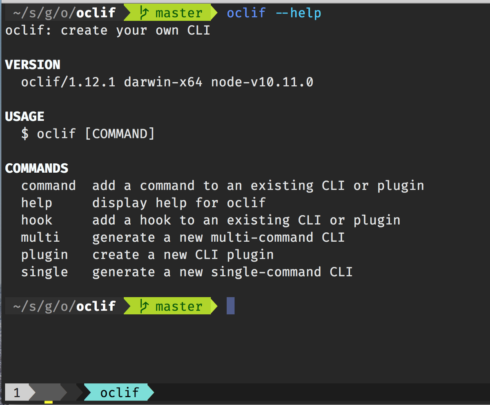

# 운영체제 큰 그림

## 운영체제 역할 1: 시스템 자원(System Resource) 관리자

- 운영체제는 Operating System 또는 OS라고 부릅니다.
- 시스템 자원(System Resource) = 컴퓨터 하드웨어
  - CPU(중앙처리장치), Memory(DRAM, RAM)
  - I/O Devices (입출력장치)
    + Monitor, Mouse, Keyboard, Network
  - 저장매체: SSD, HDD(하드디스크)

### 운영체제 역할

> 컴퓨터 하드웨어는 스스로 할 수 있는 것이 없다.

1. CPU: 각 프로그램이 얼마나 CPU를 사용할지를 결정할 수는 없다.
2. Memory: 각 프로그램이 어느 주소에 저장되어야 하는지, 어느 정도의 메모리 공간을 확보해줘야 하는지를 결정할 수는 없다.
3. 저장매체(HDD, SSD): 어떻게 어디에 저장할지는 결정할 수 없다.
4. 키보드/마우스: 스스로 표시할 수는 없음

*때문에 운영체제가 필요하다*

---

### 운영체제 종류

- Windows OS, Mac OS, 그리고 UNIX(유닉스)
- UNIX OS - UNIX계열 OS, LINUX(리눅스) OS

---

## 운영체제 역할 2: 사용자와 컴퓨터간의 커뮤니케이션 자원

## 운영체제 역할 3: 컴퓨터 하드웨어와 프로그램을 제어

-4189005.png)

---

# 운영체제와 응용 프로그램

> 프로그램을 소프트웨어이고, 소프트웨어는 운영체제, 응용프로그램(엑셀, 파워포인트 등)으로 이루어져 있다. 응용프로그램이란, 흔히 일반 PC에서 Application이며 스마트폰에서는 App이라고 부른다.

## 운영체제와 응용 프로그램간의 관계

- 운영체제는 프로그램을 관리
  - 응용 프로그램을 실행
  - 응용 프로그램간의 **권한**을 관리
    + 관리자 권한으로 실행
  - 응용 프로그램을 사용하는 **사용자**도 관리
    + 로그인
- 응용 프로그램은 누구나 만들 수 있다.
  - 응용 프로그램에 무한 반복문을 넣었다.
  - 응용 프로그램을 잘 못 작성해서, 프로그램이 다운
  - 모든 파일 삭제 막기(권한/사용자 관리)
  - 응용 프로그램이 욕심이 많아서, CPU를 자기만 쓰겠다 <-- 운영체제가 막는다.

> 그래서 운영체제는 응용프로그램을 관리

- 시스템 자원(System Resource)를 관리
- 사용자와 컴퓨터간의 커뮤니케이션을 지원

> 운영체제의 목표: 사용자가 사용하는 응용 프로그램이 효율적으로, 적절하게 동작하도록 지원
>
> 운영체제는 응용 프로그램이 요청하는 시스템 리소스를 효율적으로 분배하고, 지원하는 소프트웨어

---

# History로 보는 운영체제

## 1950년대

### ENIAC: 첫 번째 컴퓨터

**운영체제가 없습니다.**

- 1개의 응용 프로그램을 실행시키기도 바빴습니다.
- 응용 프로그램이 시스템 자원을 직접 제어

## 1960년대 초기

> 프로그램 종류도 많아지고, 사용자도 슬슬 많아지기 시작

- 민수: 프로그램a - 예상 실행 시간 12시간
- 영희: 프로그램b - 에상 실행 시간 1분
- 프로그램a -> 프로그램b
- 프로그램b -> 프로그램a
- 프로그램 하나씩 실행시키는데, 프로그램이 실행시간이 끝나면, 다음 프로그램을 실행 시켰음
- 배치 처리 시스템(batch processing system) 출현
  - 여러 응용 프로그램을 등록시켜놓으면, 순차적으로 실행하는 시스템
  - 배치 처릿 시스템을 기반으로 운영체제가 출현

## 1960년대 후반

- 새로운 개념이 제안됨
  - 시분할 시스템(Time Sharing System)
  - 멀티 태스킹(Multi Tasking)

> 운영체제로 구현되지는 않습니다.

### 시분할 시스템과 멀티 태스킹

- 응용 프로그램이 CPU를 사용하는 시간을 잘개 쪼개서, 여러 개의 응용 프로그램을 동시에 실행하는 기법
- 시분할 시스템: 다중 사용자를 지원하고 컴퓨터 응답 시간을 최소화하는 시스템
- 멀티 태스킹: 단일 CPU에서, 여러 응용프로그램의 병렬 실행을 가능케 하는 시스템
- 보통은 시분할 시스템 = 멀티 태스킹

> 멀티 프로그래밍: 최대한 CPU를 많이 활용하도록 하는 시스템 (시간 대비 CPU 활용도를 높이자)

### 배치 처리 시스템의 단접

1. 컴퓨터 응답 시간(response time)이 오래 걸릴 수 있다. (앞단에 실행 시간이 많이 필요로 하는 응용 프로그램이 실행된 경우)
2. 실행 시간도 오래걸릴 수 있습니다.  (CPU가 필요 없음에도 응용프로그램이 CPU를 점유할 수 있기 때문입니다.)

### 시분할 시스템과 배치 처리 시스템

- 시분할 시스템/멀티 태스킹
  - 핵심 기술: 시간을 잘게 쪼개서, 여러 응용프로그램을 실행
    - 컴퓨터 응답 시간을 줄일 수 있음(시분할 시스템, 다중 사용자를 지원)
    - 전체 응용 프로그램의 실행시간도 줄일 수 있음(멀티 프로그래밍)
    - 결과적으로, 사용자가 느낄때에는, 여러 응용 프로그램이 동시에 실행되는 것처럼 보인다.

## 1970년대

> 제대로된 운영체제가 등장했다.

### UNIX(유닉스) OS

- 미국 AT&T 사의 벨 연구소
  - 켄톰슨, 데니스 리치
  - 데니스 리치: C언어를 개발

#### 운영체제 개발에 C언어가 필요했던 이유

- 1970년대 이전: Assembly 언어로 소프트웨어 개발
  - CPU(명령어), Memory(주소)
  - 컴퓨터마다 각각 다시 개발해줘야 하는 단점
  - 프로그래밍 복잡도가 높음
- 1970년대 C언어가 개발된 후:
  - 컴파일러: C언어를 Assembly 언어로 변환시켜줘서 다시 작성할 필요가 없음
  - 프로그래밍 복잡도는 낮음

> C 언어를 기반으로 운영체제를 개발했다.

### UNIX 특징

- 현대 운영체제의 기본 기술을 모두 포함한 최초의 운영체제
  - 멀티 태스킹, 시분할 시스템, 멀티 프로그래밍
    + 다중 사용자 지원

## 1980년대 - 개인용 컴퓨터

- 개인용 컴퓨터 시대
  - 1980년대 이전: 대형 컴퓨터를 여러 명이 접속해서 사용 (UNIX)
  - 1980년대 ~: Personal Computer (PC)
- 용어 이해: CLI 와 GUI
  - CLI (Command Line Interface): 터미널 환경
  - GUI (Graphical User Interface): GUI 환경

### CLI vs GUI

- CLI: 키보드, 검은화면
- GUI: 마우스

### 1980년대: CLI --> GUI

- 1980년대 초반: 아직 터미널 환경
- 1980년대 중반: GUI환경 (마우스)

## 1990년대

1. 응용 프로그램 시대 by GUI환경, 개인용 컴퓨터(사용자 증대)
   - 엑셀, 워드 프로세서 등등
   - Windows OS 대중화
2. 네트워크 기술 발전 - 월드와이드웹(WWW) 인터넷 대중화
3. 오픈 소스 운동 활성화 시작
   - UNIX 계열 OS + 응용 프로그램 자체 개발, 소스 오픈
   - LINUX (리눅스) 운영체제, 소스 오픈, 무료

## 2000년대 이후

1. 오픈 소스 활성화
   - LINUX(리눅스) 운영체제
   - Apache (아파치, 웹서버)
   - MySQL(데이터베이스)
   - 요즘... 안드로이드, 딥러닝, 데이터사이언스, IoT 관련
2. 가상머신, 대용량 병렬 처리 등 활성화
   - 가상머신  - CPU하나에 여러개의 응용프로그램을 설치해서 동시에 실행시키는 장치(마치 운영체제 위에 또다른 운영체제가 있다는 가상)

### 정리

1. 1950년대: 운영체제 없음 (프로그램이 직접 시스템 자원 직접 제어)
2. 1960년대: 배치 처리 시스템
3. 1970년대: 시분할 시스템/멀티 태스킹 시스템 - UNIX OS (C 언어)
4. 1980년대: 개인용 컴퓨터, GUI
5. 1990년대: 다양한 응용프로그램, 인터넷 발달, 오픈 소스 운동 활성화
6. 2000년대: 오픈 소스 활성화, 가상 머신, 대용량 병렬 처리 등

