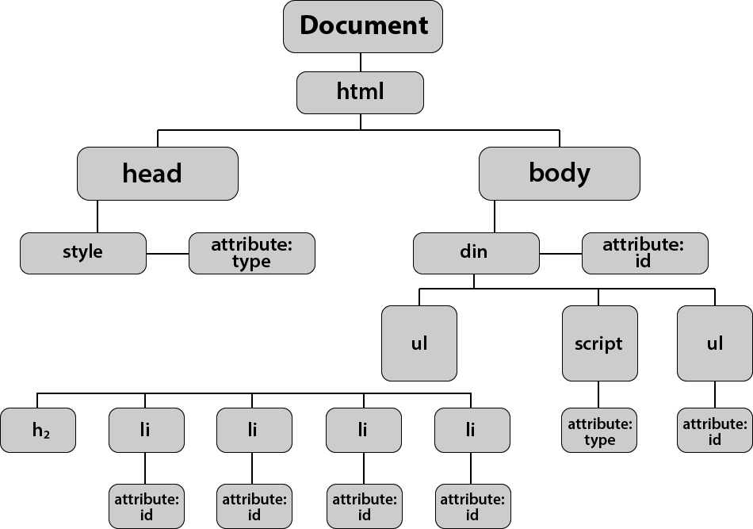
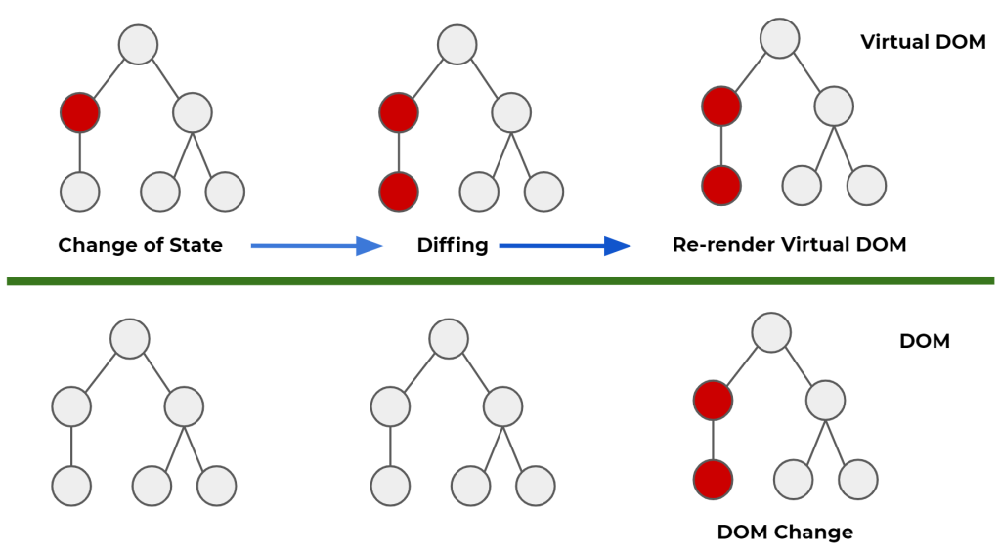

# Virtual Dom이란?

> "DOM을 추상화한 가상의 객체", 브라우저에서 실제롤 보여지는 DOM이 아니라 그냥 메모리에 가상으로 존재하는 DOM으로서 그냥 JavaScript 객체이기 때문에 작동 성능이 실제로 브라우저에서 DOM을 보여주는 것 보다 속도가 훨씬 빠르다.
>
> 리액트는 상태가 업데이트 되면, 업데이트가 필요한 곳의 UI를 Virtual DOM을 통해서 렌더링 한다.

### DOM이란?

DOM은 문서 객체 모델(The Document Object Model, 이하 DOM)이라고 하는데, HTML, XML 문서의 프로그래밍 인터페이스이다. 

DOM은 nodes와 objects로 문서를 표현한다. 이들은 웹페이지를 스크립트 또는 프로그래밍 언어들에서 사용될 수 있게 연결시켜주는 역할을 담당한다.

결국은 브라우저에서 다룰 HTML 문서를 파싱하여 **문서의 구성요소들을 객체로 구조화하여 나타낸 것 **이다.

한마디로 다시 정리 하자면, "웹 페이지를 구성하는 요소를 구조화해서 나타낸 객체고 이 객체를 이용해서 웹페이지 구성요소를 제어할 수 있다"라고 이해하면 된다.

Virtual Dom의 설명에 앞서 브라우저의 기본 렌더링 과정을 먼저 이해해야 한다.

### DOM Tree 생성

브라우저가 HTML 을 전달받으면, 브라우저의 렌더 엔진이 이를 파싱하고 DOM 노드(Node) 로 이뤄진 트리를 만든다. 각 노드는 각 HTML 엘리먼트들과 연관이 되어있다.

### Render Tree 생성

그리고, 외부 CSS 파일과 각 엘리먼트의 inline 스타일을 파싱하며. 스타일 정보를 사용하여 DOM 트리에 따라 새로운 트리, 렌더트리를 만든다.

### Attachment

Webkit 에서는 노드의 스타일을 처리하는 과정을 ‘attachment’ 라고 부른다. DOM 트리의 모든 노드들은 ‘attach’ 라는 메소드가 있는데, 이 메소드는 스타일 정보를 계산해서 객체형태로 반환한다.

이 과정은 동기적(synchronous) 작업이고, DOM 트리에 새로운 노드가 추가되면 그 노드의 attach 메소드가 실행된다.

렌더 트리를 만드는 과정에선, 각 요소들의 스타일이 계산되고, 또 이 계산되는 과정에서 다른 요소들의 스타일 속성들을 참조하게  된다.

### Layout

 렌더 트리가 다 만들어지고 나면, 레이아웃 과정을 거치게 되는데. 각 노드들은 스크린의 좌표가 주어지고, 정확히 어디에 나타나야 할 지 위치가 주어진다.

### Painting

그 다음 작업은 렌더링 된 요소들에 색을 입히는 과정이다. 트리의 각 노드들을 거쳐가면서 paint() 메소드를 호 한다. 그러고나면, 스크린에 원하는 정보가 나타나게 된다.

### Virtual DOM이 필요한 이유

위에 설명과 같이  DOM에 변화가 생기면, 렌더트리를 재생성하고 모든요소의 스타일이 다시 계산되며 레이아웃을 만들고 페인팅을 하는 과정이 다시 반복된다. 즉, 변하는 만큼 렌더링이 여러번되는 문제가 발생한다.

복잡한 SPA(싱글 페이지 어플리케이션) 에서는 DOM 조작이 많이 발생하는데, 그 뜻은 그 변화를 적용하기 위해 브라우저가 많이 연산을 해야한다는 소리고, 저체적인 프로세스를 비효율적으로 만든다.

이러한 이유들로 인해 Virtual Dom이 필요하게 되는데, 만약에 뷰에 변화가 있다면, 그 변화는 실제 DOM에 적용되기전에 가상의 DOM에 먼저 적용시키고 그 최종적인 결과를 실제 DOM으로 전달해준다. 이로써, 브라우저 내에서 발생하는 연산의 양을 줄이면서 성능이 개선되는 것이다.

###  Virtual DOM flow

> Vurtual Dom은 수정사항이 여러 가지 있더라도, 가상 DOM은 한 번만 렌더링을 일으킨다.

빨간 부분에 수정사항이 생겼다면, 가상 DOM이 알아서 달라진 값을 탐지하여 변경하고 최종적인 결과물을 실제 DOM에 전달한다. 만약 가상 DOM이 없었다면, DOM은 렌더링을 처음부터 해야했기 때문에 모든 동그라미가 다 빨간색으로 바뀌었을 것이다.

이러한 변경된 부분만 감지해서 바뀐 부분만 업데이트 하는 방식을 Diffing algorithm이라고 한다.

이는 DOM에 직접 접근해도 문제가 되진 않지만, DOM이 직접 변경된다면 사소한 변경사항에도 전체가 재렌더링 되기 때문에 브라우저에 과부하가 올 수 있다. 따라서 최대한 DOM에 직접 접근하지 말아야 한다, 라고 이해하면 될 것 같다.

