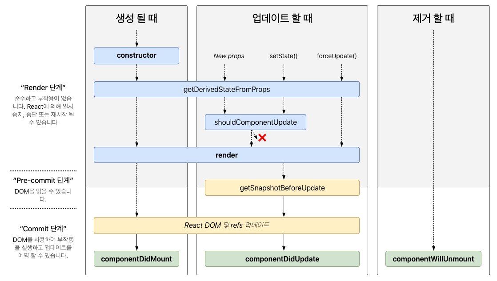

# LifeCycle

> lifeCycle 은 ''생명주기 메서드''라고 부른다. 생명주기 메서드는 컴포넌트가 브라우저상에 나타나고, 업데이트되고, 사라질때 호출되는 메서드들을 말한다. 





컴포넌트가 브라우저 상에 나타나는 것을 마운트라고 하고, 사라질 때를 언마운트라고 한다.


### 마운트


#### constructor

```constructor``` 는 컴포넌트의 생성자 메서드이다. 컴포넌트가 만들어지면 가장 먼저 실행되는 메서드이다.

```react
	constructor(props) {
    super(props);
  }
```


#### getDerivedStateFromProps

```getDerivedStateFromProps``` 는 ```props``` 로 받아온 것을 ```state```에 넣어주고 싶을 때 사용하며, 컴포넌트가 마운트될 때와 업데이트 될 때 호출된다.

```react
static getDerivedStateFromProps(nextProps, prevState) {
    console.log("getDerivedStateFromProps");
    if (nextProps.color !== prevState.color) {
      return { color: nextProps.color };
    }
    return null;
  }
```

여기서 특정 객체를 변환하게 된면 해당 객체 안에 있는 내용들이 컴포넌트의 ```state``` 로 설정이 된다. 반면 ``null`` 을 반환하게 되면 아무 일도 발생하지 않는다.

이 메서드는 처음 렌더링 되기 전, 그 이후 리렌더링 되기 전에도 매번 실행된다.


### componentDidMount

컴포넌트의 첫번째 렌더링이 마치고 나면 호출되는 메서드이다. 이 메서드가 호출되는 시점에는 우리가 만든 컴포넌트가 화면에 나타난 상태이다. 여기선 주로 D3, masonry 처럼 DOM 을 사용해야하는 외부 라이브러리 연동을 하거나, 해당 컴포넌트에서 필요로하는 데이터를 요청하기 위해 axios, fetch 등을 통하여 ajax 요청을 하거나, DOM의 속성을 읽거나 직접 변경하는 작업을 진행한다.

### render

컴포넌트를 렌더링하는 메서드이다.


### 업데이트

업데이트는 다음과 같은 4가지 상황에서 발생한다.

- props가 바뀔 때
- state가 바뀔 때
- 부모 컴포넌트가 리렌더링 될 때
- This.forceUpdate로 강제로 렌더링을 트리거할 때


### shouldComponentUpdate

```shouldComponentUpdate``` 메서드는 컴포넌트가 리렌더링 할지 말지를 결정하는 메서드이다.

```react
shouldComponentUpdate(nextProps, nextState) {
  console.log("shouldComponentUpdate", nextProps, nextState);
  // 숫자의 마지막 자리가 3이면 리렌더링하지 않습니다.
  return nextState.number % 10 !== 3;
}
```


### getSnapshotBeforeUpdate

```getSnapshotBeforeUpdate``` 는 컴포넌트에 변화가 일어나기 직전의 DOM 상태를 가져와서 특정 값을 반환하면 그 다음 발생하게 되는 ``componentDidUpdate`` 함수에서 받아와서 사용할 수 있다.

```react
getSnapshotBeforeUpdate(prevProps, prevState) {
    console.log("getSnapshotBeforeUpdate");
    if (prevProps.color !== this.props.color) {
      return this.myRef.style.color;
    }
    return null;
  }
```


### componentDidUpdate

``componentDidupdate`` 는 리렌더링이 마치고, 화면에 우리가 원하는 변화가 모두 반영되고 난 뒤 호출되는 메서드이다.

3번째 파라미터로 ``getSnapshotBeforeUpdate`` 에서 반환한 값을 조회 할 수 있다.

```react
componentDidUpdate(prevProps, prevState, snapshot) {
    console.log("componentDidUpdate", prevProps, prevState);
    if (snapshot) {
      console.log("업데이트 되기 직전 색상: ", snapshot);
    }
  }
```


### 언마운트

언마운트에 관련된 생명주기 메서드는 ``componentWillUnmount`` 하나이다.


### componentWillUnmount

``componentWillUnmount`` 는 컴포넌트가 화면에서 사라지기 직전에 호출된다.

```react
componentWillUnmount() {
    console.log("componentWillUnmount");
  }
```


